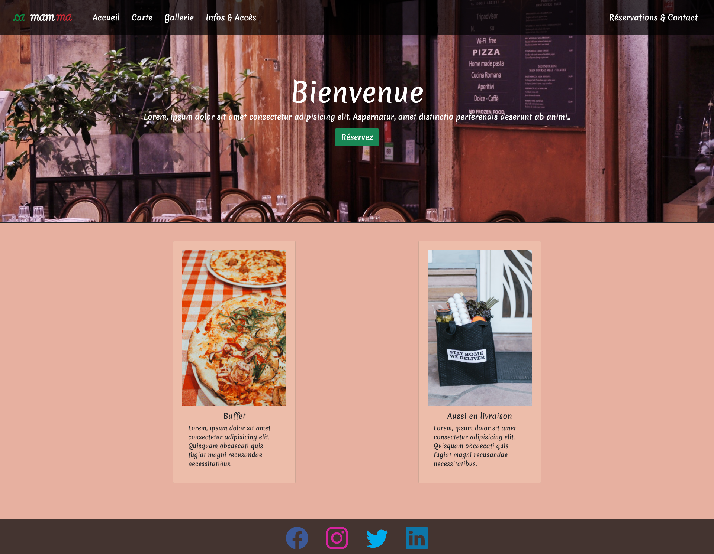

# Restaurant - CSS Framework

Réalisation d'un projet de groupe dans le cadre de la formation Web dév chez @becodeorg visant a réaliser un site pour un restaurant hypothétique

## Voir le projet

Vous pouvez visualiser la page web via cette url [Restaurant - CSS Framework](https://adrienlenoir.github.io/restaurant-css-framework/)

## Librairie / Toolkit
* [Boostrap Icône](https://icons.getbootstrap.com/) - Kit d'icône (SVG)
* [Google Fonts](https://fonts.google.com/) - Fonts (Merienda & Pacifico)

## Crédit images
* [Pexels](https://www.pexels.com/) - l'ensemble des images du site

## Auteurs
* **Adrien Lenoir** _alias_ [@AdrienLenoir](https://github.com/AdrienLenoir)
* **alain17-web** _alias_ [@alain17-web](https://github.com/alain17-web)
* **evrardsibo** _alias_ [@evrardsibo](https://github.com/evrardsibo)
* **EvelyneCG** _alias_ [@EvelyneCG](https://github.com/EvelyneCG)

